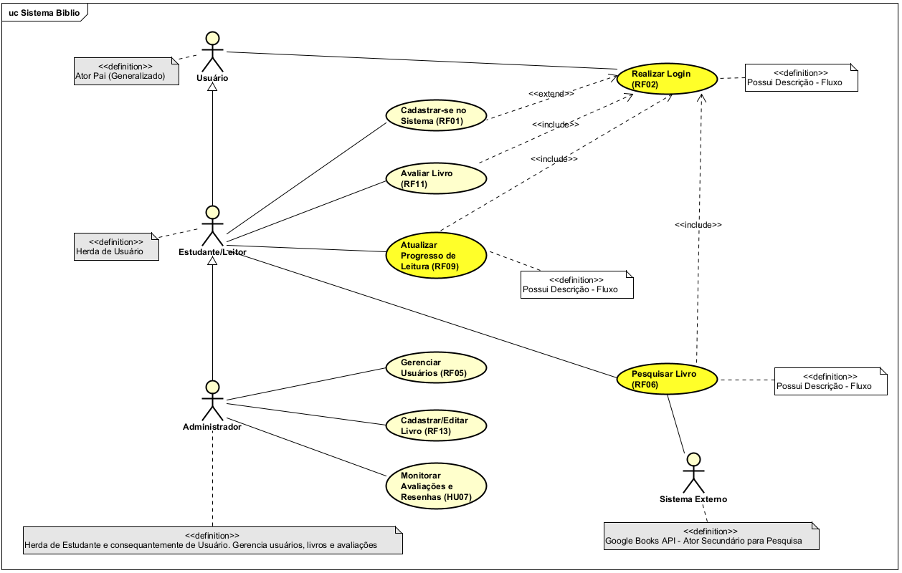
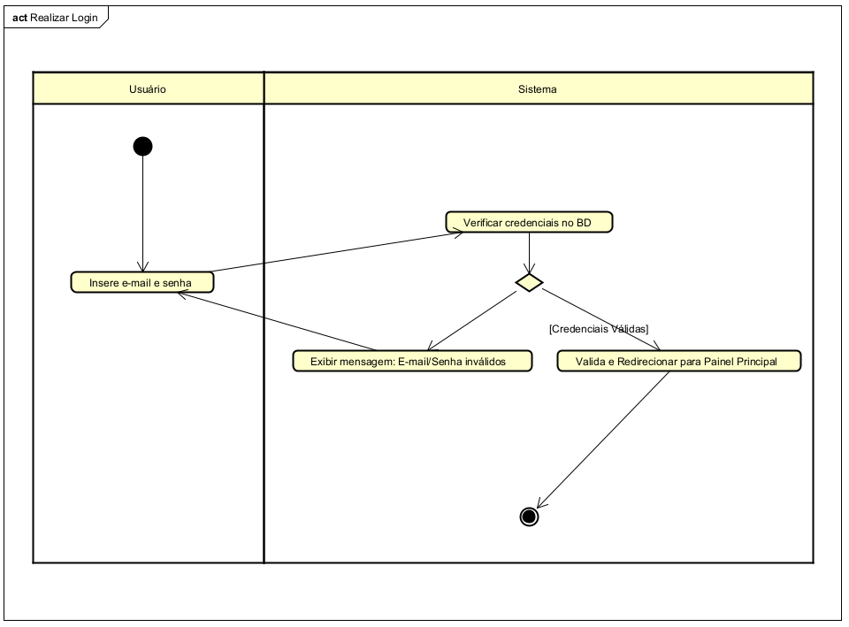
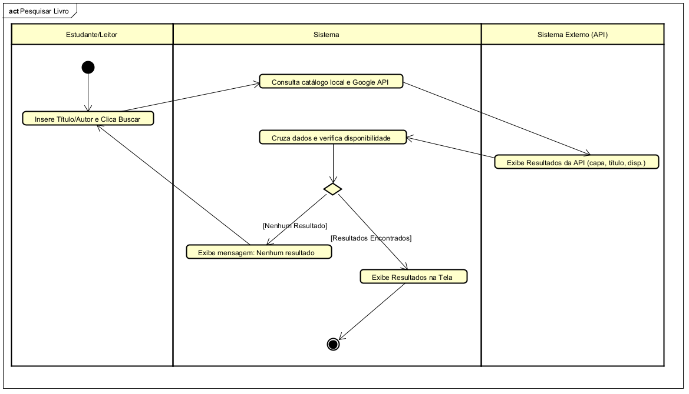
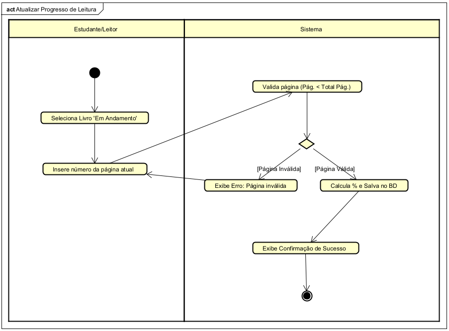
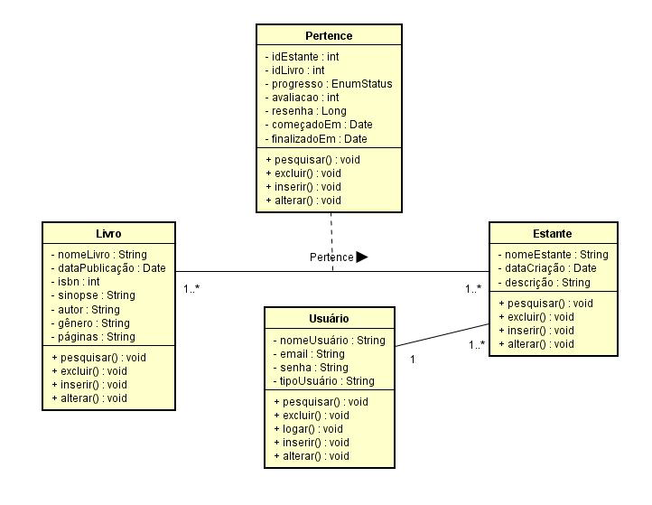
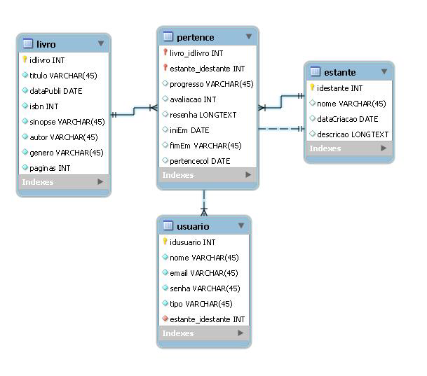

# Requisitos de Sistema - Modelagem Conceitual (UML)

Esta seção contém a modelagem conceitual do sistema Biblio, criada com a ferramenta **Astah UML**, seguindo a estrutura de pacotes: Diagramas de Casos de Uso, Diagramas de Atividades e Diagramas Estruturais.

O projeto foi atualizado para contemplar todos os requisitos e histórias de usuário definidos.

[**Download do Projeto Astah UML (Biblio_Modelagem_Agil.astah)**](Diagramas_Projeto_Codex_Biblio.asta)

---

## 1. Diagramas de Casos de Uso

O Diagrama de Casos de Uso (DCU) apresenta a visão funcional completa, os Atores (incluindo o Ator Generalizado 'Usuário' e a herança) e a rastreabilidade com os Requisitos Funcionais (RF). Os Casos de Uso **Realizar Login**, **Pesquisar Livro** e **Atualizar Progresso de Leitura** contêm a descrição do Fluxo de Eventos Normal e de Exceção detalhada no projeto Astah.

---

## 2. Diagramas de Atividades

Os Diagramas de Atividades (DA) representam o Fluxo de Eventos Normal dos Casos de Uso mais críticos do sistema, utilizando Partições (Swimlanes) para dividir responsabilidades entre o Usuário e o Sistema.

### 2.1. Fluxo: Realizar Login

Descreve o fluxo de sucesso para o usuário se autenticar na plataforma.

### 2.2. Fluxo: Pesquisar Livro

Detalha o processo de busca do usuário, a consulta à API Google Books e a exibição dos resultados.

### 2.3. Fluxo: Atualizar Progresso de Leitura

Descreve as etapas para o usuário registrar o avanço de leitura de um livro, incluindo a validação da página.

---

## 3. Diagramas Estruturais (Modelagem Estática)

Esta seção apresenta os modelos que definem a estrutura estática e o banco de dados do sistema, complementando a modelagem comportamental.

### 3.1. Diagrama de Classes

Representa as classes principais do sistema (Usuário, Livro, Estante, Pertence) e seus atributos e métodos, demonstrando as relações entre elas.

### 3.2. Diagrama de Entidades e Relacionamentos (DER)

Representa o modelo de dados utilizado no banco de dados MySQL, com as tabelas e a estrutura de chaves.

